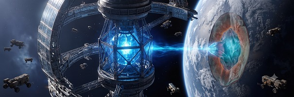
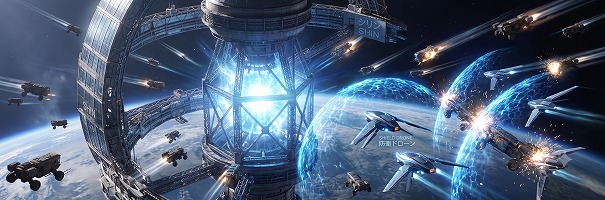
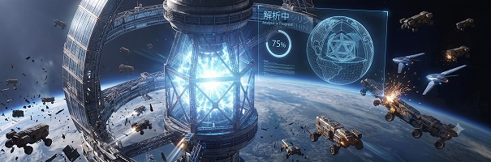
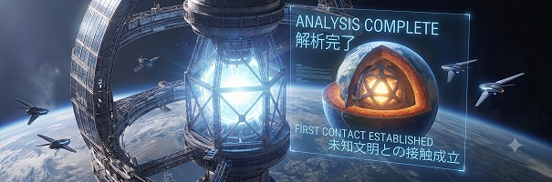
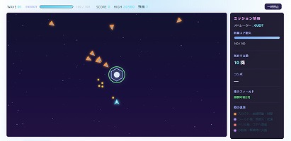

# 星のきろく

地球軌道防衛型アクションシューティングゲーム。

星のきろくは、HTML、CSS および JavaScript の学習を目的として制作した、オリジナルの軌道防衛型アクションシューティングゲームです。ゲーム内のプログラム、キャラクター、画面構成および演出は独自に制作しています。第三者が権利を保有するゲームの画像、ロゴ、プログラムおよびキャラクターは使用していません。タイトル画面のイントロ動画には、Pixabay の Content License に基づく音源を利用しています。

## ストーリー

西暦2xxx年。
地球の衛星軌道上で、採掘ステーション「Shin」は希少鉱石の採掘を続けていた。
ある日、地球の地下深層から発見された未知の結晶体が、ステーションのエネルギーコアと共鳴する。



コアは膨大な信号を放ち、周囲の採掘ドローン群はそれを古代装置への「帰還信号」として受信した。
飛行物体は悪意を持って攻撃しているのではなく、何かに呼び戻されるようにコアへ突入しようとしている。



プレイヤーの任務は、防衛ドローンを操作してコアへの突入を阻止し、信号解析が完了するまでの時間を稼ぐこと。
ウェーブを防衛するたびにコアの解析が進み、やがて地球内部に眠る巨大な人工構造体の存在が明らかになる。



防衛に成功することは、単にステーションを守ることではない。
人類が未知文明との扉を開くための、最初の接触を成立させることでもある。



## 実行方法

以下のいずれかの方法で実行できます。

- `index.html` をブラウザで直接開く
- VS Code の Live Server / Five Server 拡張機能で起動する
- GitHub Pages に公開する



対象ブラウザ: Google Chrome / Microsoft Edge / Firefox の最新版。

## 操作方法

| 操作内容           | キー                               | エネルギー消費            |
| ------------------ | ---------------------------------- | ------------------------- |
| 移動（上下左右）   | WASD または矢印キー                | -                         |
| 攻撃（長押し可）   | Space                              | 通常弾2 / 拡散弾8 / EMP30 |
| ダッシュ           | Shift                              | 15                        |
| 武器切替           | 1（通常弾）、2（拡散弾）、3（EMP） | -                         |
| 重力フィールド展開 | E                                  | -（再使用まで10秒）       |
| 一時停止・再開     | Esc または P                       | -                         |
| 任務開始           | Enter（タイトル画面）              | -                         |
| やり直し           | R（ゲームオーバー・一時停止中）    | -                         |

## ルール概要

- 画面中央の防衛コアを、複数方向から出現する採掘ドローンの編隊から守ります。
- 敵をすべて無力化するとウェーブクリア。3種類から1つ選ぶアップグレードで機体を強化し、次のウェーブへ進みます。
- コアの耐久値が0になるか、自機の残機が尽きるとゲームオーバーです。
- 攻撃とダッシュは共通のエネルギーを消費します。エネルギー管理が生存の鍵です。
- 弾は最も近い敵を自動で狙います。敵がいないときは機体の向きに発射します。
- 重力フィールドは5秒間持続し、範囲内の敵弾の軌道を外側へ曲げます。
- EMP は自機周囲の敵にダメージを与え、敵弾を消去し、生成した敵を短時間スタンさせます。
- 短時間の連続撃破でコンボ倍率が上がります。
- ウェーブクリア時にコア残存耐久値のボーナス得点が入ります。
- ハイスコア、難易度設定、オペレーター名は `localStorage` に保存されます。

## 敵の種類

| 敵         | 形状                    | 特徴                                           |
| ---------- | ----------------------- | ---------------------------------------------- |
| スカウト   | オレンジの三角形        | 曲線を描いて接近し、プレイヤーを狙って射撃する |
| シールド機 | 紫の六角形 + 耐久リング | 低速・高耐久でコアへ直進する                   |
| ドリル機   | 赤の細長い菱形          | 高速でコアへ直進する。コアへの損害が最大       |
| 分裂機     | 紫の球体 + 3本アーム    | 蛇行して接近し、撃破すると小型機2体に分裂する  |
| 小型機     | 小さな三角形            | 分裂機から生まれる高速の小型ドローン           |

敵はウェーブが進むごとに速度、耐久、出現数が増加します。難易度（イージー / ノーマル / ハード）でも変化します。

## ファイル構成

```text
record_of_the_stars/
├─ index.html
├─ css/
│  └─ style.css
├─ js/
│  ├─ main.js
│  ├─ game.js
│  ├─ player.js
│  ├─ enemy.js
│  ├─ stage.js
│  ├─ projectile.js
│  ├─ collision.js
│  ├─ audio.js
│  └─ config.js
├─ assets/
│  ├─ images/
│  └─ move/
│     ├─ 星のきろく.mp4
│     ├─ 星のきろく_フル.mp4
│     ├─ watermello-sport-techno-477131.mp3
│     └─ *.txt
└─ README.md
```

## テストの実行

```bash
node tests/logic-test.js
```

ブラウザ API（Canvas / localStorage）をモックした状態で、エネルギー消費、コンボ倍率、分裂機、重力フィールド、コア耐久、ウェーブ進行などのロジックを自動検証します。

## 素材について

- ゲーム本体の画像素材は使用していません。自機、敵、弾、背景はすべて Canvas API の図形描画で表現しています。
- ゲーム本体の効果音は、Web Audio API のオシレーターでリアルタイム合成しています。
- タイトル画面のイントロ動画 `assets/move/星のきろく_フル.mp4` には、Pixabay Content License の音源を利用しています。ライセンス証明書は `assets/move/*.txt` に保管しています。
- `assets/move/watermello-sport-techno-477131.mp3` は Pixabay Content License の音源です。単体素材として再配布・販売する用途ではなく、プロジェクト素材として管理しています。
- 外部ライブラリは使用していません。Vanilla JavaScript で実装しています。

## 権利面の確認

- 現行のゲーム名、画面表示、説明文は `星のきろく` に統一しています。
- 舞台設定は地球と軌道ステーション「Shin」を中心とした独自設定です。
- 敵、自機、コアは独自のドローン / 軌道防衛設定で、既存ゲームのキャラクター画像、ロゴ、音声、ソースコードは使用していません。
- 旧案の名称や設定は現行仕様では使用しません。
